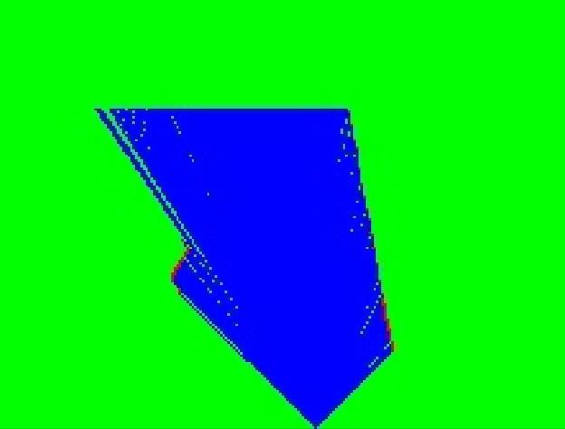
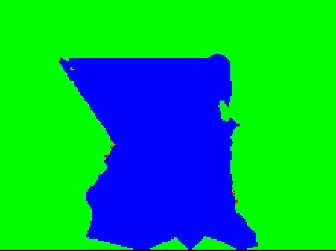
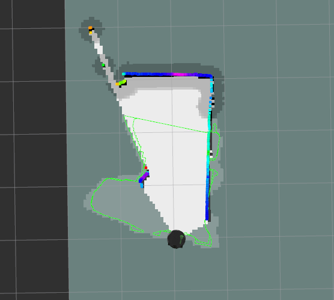

# ProxMaP-Navigation
Risk-aware navigation using occupancy map predictions from deep learning (ProxMaP: Proximal Occupancy Map Prediction)

## Overview
This project focuses on the development of innovative planning and navigation strategies for autonomous robots in unfamiliar environments. By utilizing deep neural networks to predict occupancy grid maps, it addresses the challenges faced when occlusions cause "holes" or unknown cells in the grid. The solution employs state-of-the-art methodologies for predicting occupancy values in occluded areas, enabling efficient navigation in complex environments. Unlike traditional methods, this approach allows robots to navigate more aggressively by predicting previously unknown areas instead of restricting movement to known spaces.

Emphasizing robot safety, the project aims to create high-speed, risk-aware navigation techniques that adapt to various environments. The robot can thus move quickly in unobstructed and known spaces while slowing down and cautiously adjusting its path in predicted areas to account for potential obstacles.

## Building the project and Installating dependencies
1. Clone the repository
```bash
git clone https://github.com/prat1kbhujbal/ProxMaP-Navigation.git
```
2. Install dependencies
```bash
cd <your_ws>/
rosdep install --from-paths src --ignore-src -r -y
```
3. Build the project
```bash
catkin_make
```

## Running the project
1. Launch the simulation
```bash
roslaunch turtlebot_gazebo turtlebot_world.launch
```
2. Launch the mapping and navigation nodes
```bash
roslaunch turtlebot_navigation mapping.launch
```
3. Launch the prediction update node
```bash
roslaunch proxmap_ros main.launch show_predmap:=true
```
Param: show_predmap (default: false) - To visualize the occupancy map predictions on Rviz. Keep it false for less computation cost.

4. Launch the Adaptive Speed node  
```bash
roslaunch proxmap_ros adaptive_speed.launch
```
5. Launch the goal publisher node
```bash
roslauch proxmap_ros goal_pub.launch
```
Update your goal points as per your environment in the file `goal_publisher.py` in `ProxMaP_ROS/proxmap_ros/scripts` folder.

This will generate a csv file with the results in the folder `results/` i,e time taken for each goal point to be reached and total time taken for all the goal points to be reached.

## Results
https://github.com/prat1kbhujbal/ProxMaP-Navigation/assets/55290437/f4f43f06-7701-4901-843b-3aff37163fff

<table>
  <tr>
    <td>&nbsp; &nbsp; &nbsp; &nbsp; &nbsp; &nbsp; &nbsp; &nbsp; &nbsp; &nbsp; &nbsp; &nbsp; &nbsp; &nbsp; &nbsp; &nbsp; &nbsp; &nbsp; &nbsp; &nbsp; &nbsp; &nbsp; &nbsp; &nbsp; &nbsp; &nbsp; &nbsp; &nbsp;  Environment setup</td>
     <td> &nbsp; &nbsp; &nbsp; &nbsp; &nbsp; &nbsp; &nbsp; &nbsp; &nbsp; &nbsp; Robot's starting location</td>
  </tr>
  <tr>
    <td></td>
    <td></td>
  </tr>
 </table>
<table>
  <tr>
   <td>&nbsp; &nbsp; Laser data conversion to image format</td>
     <td>&nbsp; &nbsp; &nbsp; &nbsp; &nbsp; &nbsp; Occupancy map prediction</td>
    <td>Integration of predicted map onto costmap</td>
  </tr>
  <tr>
    <td></td>
    <td></td>
    <td></td>
  </tr>
 </table>

## Reference
> [1] Sharma, V.D., Chen, J. and Tokekar, P., 2023. ProxMaP: Proximal Occupancy Map Prediction for Efficient Indoor Robot Navigation. arXiv preprint arXiv:2305.05519.  
> [2] https://github.com/GMahmoud/virtual_costmap_layer
